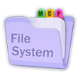

<!-- _coverpage.md -->

<!--  -->

<!-- x-release-please-start-version -->

# Rust MCP FileSystem (v0.1.8)

<!-- x-release-please-end -->

> Blazing-fast, asynchronous MCP server for seamless filesystem operations.

- 🪶 Lightweight
- ⚡ High Performance
- 🔒 Read-Only by Default

[GitHub](https://github.com/rust-mcp-stack/rust-mcp-filesystem)
[⚙️ Capabilities](capabilities.md)
[Get Started](#rust-mcp-filesystem)

<!-- background color -->

>)
